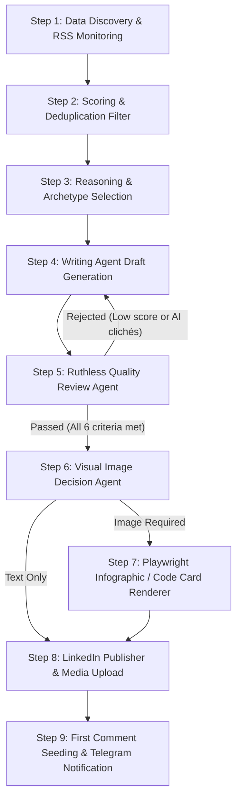

# Autonomous LinkedIn Content Agent: System Blueprint & Architecture

> **Author**: Aquib Rashid Shaikh  
> **Role Grounding**: Senior Android Developer & Mobile Tech Lead (8+ Years Experience)  
> **Core Domains**: Kotlin & Jetpack Compose, BLE & Hardware Interop, FinTech & Banking Systems, OTT Video Streaming (ExoPlayer/Media3), Maps & Geofencing, Mobile Architecture at Scale (50M+ Users)  
> **System Location**: `LinkedIN-Post-automation/`

---

## 1. Complete End-to-End System Flow

The autonomous pipeline operates as an iterative, multi-stage agentic workflow designed to produce high-signal, non-AI-sounding engineering content:



### Phase Details

1. **Step 1: Data & Trend Discovery**
   - Fetches from top mobile engineering sources: *Android Developers Blog, ProAndroidDev, Android Weekly, Kotlin Blog, Google Git AOSP Commits, Reddit (r/androiddev)*.
   - Fallback to curated production challenges from Aquib's core domains (BLE GATT serialization, ExoPlayer LoadControl, Binder 1MB IPC limits, Jetpack Compose stability).

2. **Step 2: Scoring & Semantic Deduplication**
   - Scores candidates on: **Senior Relevance (0-1)**, **Architectural Depth (0-1)**, and **Recruiter/EM Appeal (0-1)**. Minimum score required: `0.70`.
   - Checks title & content embeddings against `data/post_history.json` to guarantee zero repetition within a 45-day window.

3. **Step 3: Pre-Creation Reasoning & Strategy**
   - The agent evaluates *why* this topic matters, *which* of Aquib's 5 real-world domains it reinforces, and *what* trade-offs are involved.
   - Rotates across 5 distinct developer post archetypes (no formulaic repetition).

4. **Step 4: Writing Agent Execution**
   - Synthesizes technical knowledge from `knowledge/*.md`, persona constraints from `config/persona.json`, and dynamic hook strategies from `scripts/hook_matrix.py`.
   - Strictly suppresses AI clichés, marketing buzzwords, asterisks (`*`), and formulaic time anchors (*"Three weeks ago..."*).

5. **Step 5: Multi-Metric Quality Review Gate**
   - An independent LLM evaluation agent rigorously grades the draft across 6 metrics:
     - Technical Accuracy (Min: 8/10)
     - Naturalness / Human Tone (Min: 8/10)
     - Originality (Min: 7/10)
     - Engineering Usefulness (Min: 7/10)
     - LinkedIn Scannability (Min: 7/10)
     - AI-Jargon Level (Must be $\le$ 3/10 — rejects any draft sounding like ChatGPT)
   - If failed, the agent sends critical rewrite instructions back to Step 4 (up to 3 retries).

6. **Step 6 & 7: Visual Image & Infographic Engine**
   - Determines if the post benefits from a visual (architecture flow, OS state machine, or syntax-highlighted code block).
   - Generates structured JSON schema and renders a pixel-perfect 1080×1410 dark-mode PNG via headless Chromium (Playwright).

7. **Step 8 & 9: Publishing & Community Seeding**
   - Publishes directly to LinkedIn API using OAuth2 Person URN (`urn:li:person:sYPtfVgA8C`).
   - Automatically drops a thoughtful author seed comment (`FIRST_COMMENT`) to stimulate peer debate.
   - Sends real-time publishing confirmation with shareable URL to Telegram.

---

## 2. What I Think Before Creating (Agent's Mental Model)

Before generating a single word, the agent passes the idea through an **Internal Engineering Filter**:

### Filter 1: Is this an actual Senior/Staff problem or a beginner tutorial?
- ❌ *Reject*: "How to use `remember` in Jetpack Compose" (Junior tutorial).
- ✅ *Accept*: "How unstable lambda captures cause silent recomposition loops in 60fps lazy lists, and when to use `@Immutable` vs. method references" (Staff problem).

### Filter 2: What is the hidden failure mode under production load?
- The agent actively asks: *What breaks when 100,000 concurrent users hit this?*
  - Does it cause battery drain via unthrottled BLE scanning?
  - Does it throw `TransactionTooLargeException` over Android's 1MB shared Binder buffer?
  - Does it trigger an ANR when ART runs garbage collection on the main thread?
  - Does it crash on Process Death when the OS LMK kills the app process?

### Filter 3: Does this sound like a real human engineer over coffee?
- Real developers don't talk like press releases:
  - ❌ *"In today's fast-paced mobile landscape, Jetpack Compose is a game changer that unlocks unprecedented agility."*
  - ✅ *"Debugging a race condition where checkout shows 'Payment Successful' while displaying an empty cart usually points to one failure: split mutable state."*

### Filter 4: Does this reinforce Aquib's credibility for Hiring Managers & EMs?
- Every post subtly signals senior competencies:
  - Architecture ownership (Clean Architecture, Modularization, Design Systems).
  - Production resilience (99.9% crash-free sessions, graceful degradation, offline-first).
  - Scaled impact (50M+ users, ICICI iMobile, GCash Super App).

---

## 3. What Information I Hold About You (Aquib Rashid Shaikh)

The agent operates with full context of your verified career history, achievements, and technical strengths:

| Attribute | Verified Profile Grounding |
| :--- | :--- |
| **Name & Identity** | Aquib Rashid Shaikh — Senior Android Developer & Mobile Tech Lead |
| **Total Experience** | 8+ Years building enterprise mobile applications |
| **Scale Handled** | **50M+ active users** on tier-1 applications (ICICI iMobile Banking, GCash Super App) |
| **Stability Metric** | Consistently maintained **99.9% crash-free session rates** in production |
| **Companies** | Perennial Systems (Team Lead), Tata Consultancy Services (TCS), Capgemini |
| **Key Projects** | **ICICI iMobile**: High-throughput banking, Keystore biometric crypto, secure transactions.<br>**GCash Super App**: Micro-frontend native bridges, modular features, millions of DAU.<br>**EnterCard Scandinavia**: Secure credit card & financial management.<br>**BLE Gate & Hardware Access**: Proximity-based automated gate unlock, GATT queueing. |
| **Core Tech Stack** | Kotlin, Jetpack Compose, Coroutines/Flow, Media3/ExoPlayer, BLE GATT, Room, Dagger/Hilt |
| **Specialized Domains** | • **Bluetooth Low Energy (BLE)**: GATT status 133, connection serialization, MTU 517.<br>• **OTT Video Streaming**: ExoPlayer/Media3, custom `LoadControl`, low-latency HLS/DASH.<br>• **FinTech & Security**: Android Keystore, hardware-backed crypto, idempotency tokens.<br>• **Maps & Geofencing**: FusedLocationProvider, battery-optimized background fencing.<br>• **Design Systems**: Custom internal Design System (DFF) packaged as Maven artifacts. |

### Persona Voice & Tone Rules
- **Tone**: Authoritative yet humble, pragmatic, highly technical, direct.
- **Perspective**: First-person engineering experience (*"Under heavy traffic...", "In banking apps...", "When profiling on lower-end devices..."*).
- **Strictly Banned Phrases**:
  - *"Three weeks ago", "Two weeks ago", "Six weeks ago", "Days ago, I believed", "On Tuesday, I ran"*
  - *"Game changer", "Revolutionary", "Unlock the power of", "10x your productivity"*
  - *"In today's fast-paced digital world", "Delve", "Testament", "Exciting times"*
  - Markdown asterisks (`**` or `*`) and underscores (`_`) that break formatting on LinkedIn feeds.

---

## 4. Visual Image & Infographic Design Strategy

Real developers ignore generic clip-art, cartoon sticky notes, and stock photos. When the agent designs visuals, it follows strict **Engineering Design Principles**:

### 1. Canvas Dimensions & Feed Geometry
- **Aspect Ratio**: **4:5 Vertical Portrait (1080 × 1410 px)**.
- **Why**: Takes up 60% more vertical feed real estate on mobile devices compared to standard landscape images, stopping the user's thumb while scrolling.

### 2. Dark Mode Color Psychology
- **Background (`--paper`)**: Deep near-black navy (`#0b0e16`).
  - *Reasoning*: LinkedIn's UI is overwhelmingly white and gray. A rich, high-contrast dark card creates an immediate visual contrast.
- **Raised Panel Surface (`--panel`)**: `#161a24` with 1px translucent borders (`rgba(255, 255, 255, 0.08)`).
- **Accent Violet (`#a78bfa`)**: Primary focal point for headlines and architecture boundaries.
- **Emerald Green (`#4ade80`)**: Terminal outputs, resolved states, and successful state transitions.
- **Amber Gold (`#fbbf24`)**: Critical metrics, system warnings, and latency numbers.

### 3. Typography Hierarchy
- **Header Line 1 & 2**: `Archivo Black` & `Space Grotesk` (bold, modern, authoritative engineering look).
- **Body & Points**: `Inter` (500/600 weight) for clean readability on high-DPI screens.
- **Code & Telemetry**: `JetBrains Mono` for syntax highlighting, state names, and log snippets.

### 4. Layout Architecture (Zero AI Clichés)
- **No cartoon sticky notes or pushpins**.
- **No "AI SYSTEMS" boilerplate** — replaced with:
  `AQUIB SHAIKH // MOBILE ARCHITECTURE & ANDROID INTERNALS`
- **Two Core Visual Templates**:
  1. **Architecture Blueprint Card**: Visualizes state flow (`Event → Reducer → StateFlow → Compose Recomposition`), process death recovery, or BLE packet queues.
  2. **Syntax-Highlighted Carbon-Style Code Card**: Clean Kotlin snippet comparing *The Anti-Pattern* vs. *The Production Fix* with annotated callouts.

---

## 5. Sample & Placeholder Posts Across 5 Out-of-the-Box Archetypes

Here is how real senior developer posts look across the 5 distinct content formats:

---

### Archetype 1: The Code Autopsy / Teardown (Before vs. After)

**Topic**: Unstable Lambdas & Recomposition Storms in Jetpack Compose  
**Visual**: Syntax-highlighted Kotlin Code Card

```text
Passing ViewModel instances down your Composable tree is not Clean Architecture. It is the number one cause of untraceable recomposition loops in production apps.

When your Composable accepts an entire ViewModel, three things break silently:
1. Compose Preview tooling dies because it cannot instantiate your ViewModel's dependencies.
2. The Compose compiler marks your Composable as unstable, forcing it to recompose even when its actual displayed state hasn't changed.
3. Unit testing UI behavior now requires mocking complex coroutine scopes instead of passing plain data classes.

The production fix is simple:
Hoist the state completely. Pass an immutable data class for UI representation and plain lambdas for user actions.

Bad pattern:
@Composable
fun PaymentScreen(viewModel: CheckoutViewModel) {
    val state by viewModel.uiState.collectAsStateWithLifecycle()
    PaymentButton(onClick = { viewModel.processPayment() })
}

Production pattern:
@Composable
fun PaymentScreen(
    state: PaymentUiState,
    onPayClicked: () -> Unit
) {
    PaymentButton(onClick = onPayClicked)
}

Your Composable becomes a pure, predictable rendering function of state. Previews work out of the box, recomposition skips cleanly, and refactoring business logic never touches your UI layout.

What is your team's rule on ViewModel hoisting in multi-module codebases?

#AndroidDev #Kotlin #JetpackCompose #MobileArchitecture #CleanCode

FIRST_COMMENT: We instituted a strict lint check on our design system components: zero ViewModel imports permitted inside UI packages. It cut recomposition count on our checkout screen by over 40%.
```

---

### Archetype 2: The Scale Incident & Debugging War Story (50M+ Users)

**Topic**: Android 1MB Binder IPC Transaction Limits in High-Volume Banking  
**Visual**: Architecture Blueprint Card showing IPC Buffer Saturation

```text
At 50 million users, a 0.05% crash rate means 25,000 broken user sessions every week.

One of the most elusive crashes in high-volume Android apps is TransactionTooLargeException. The terrifying part? It never happens on clean developer devices running Pixel emulators.

Here is the underlying OS reality:
Every Android process shares a single 1MB Binder transaction buffer for all ongoing IPC calls—including Activity result passing, cross-process Services, and SavedInstanceState restoration.

When a user on a low-memory device minimizes your app, the OS prepares for Process Death by serializing your screen state. If your ViewModel or Navigation argument serialized a heavy list of transaction objects or raw JSON strings, the Binder buffer saturates instantly:
java.lang.RuntimeException: android.os.TransactionTooLargeException: data parcel size 1048576 bytes.

The app crashes silently in the background before the user even navigates back.

Three production rules we instituted:
→ Never pass domain objects through Android Intent or Bundle arguments. Pass primitive IDs only (e.g. accountId, txnRefId).
→ Fetch fresh state from your local Room cache / DataStore upon screen recreation.
→ Keep SavedStateHandle payloads strictly under 50KB.

The Binder buffer is a system highway, not your personal database. Treat it like a tight pipe.

Have you encountered TransactionTooLargeException in production? How did you detect it before it hit users?

#AndroidDev #MobileArchitecture #FinTech #Kotlin #PerformanceEngineering

FIRST_COMMENT: Pro tip for debugging this locally: enable 'Don't keep activities' in Developer Options and dump your bundle sizes with a custom SavedStateRegistryOwner hook in debug builds.
```

---

### Archetype 3: The Under-the-Hood / OS Internals Deep Dive

**Topic**: Android Foldables Architecture vs. iOS Windowing Primitives  
**Visual**: Side-by-Side Comparison Spec Card

```text
Foldable devices exposed a fundamental architectural divide between Android and iOS: handling dynamic hardware geometry without dropping state.

On standard devices, an app lifecycle is predictable: Created, Started, Resumed.
On a foldable device, folding the screen or shifting to flex mode triggers an instant, radical runtime event:
Physical display resolution changes, screen density shifts, and window aspect ratio flips from 21:9 to 4:3 in milliseconds.

Why Android's architecture is uniquely suited for this at the OS level:
1. Jetpack WindowManager uses a reactive Kotlin Flow to stream FoldingFeature state (FLAT vs HALF_OPENED hinge posture) directly into the UI state machine.
2. Android's Multi-Resume capability (introduced natively in Android 10) allows two split-screen apps to execute concurrently in the RESUMED state simultaneously without pausing video or audio playback.
3. Jetpack Compose's declarative layout engine adapts to WindowSizeClasses (Compact, Medium, Expanded) without requiring full Activity destruction and recreation.

On iOS, handling multiple arbitrary window splits remains bounded by iPadOS Stage Manager's fixed tile boundaries, whereas Android treats every fold posture as a continuous, reactive hardware signal.

The biggest architectural mistake mobile teams make with foldables:
Using android:configChanges="orientation|screenSize" to bypass Activity recreation. You aren't fixing the problem; you're accumulating technical debt that explodes when your Compose layouts desynchronize from the window manager.

Are you building responsive layouts with WindowSizeClass yet, or still treating tablets and foldables as scaled-up phones?

#AndroidDev #MobileArchitecture #Kotlin #JetpackCompose #SystemDesign

FIRST_COMMENT: The hardest edge case we solved was ExoPlayer picture-in-picture transitions when folding from outer display to inner screen while playing DRM-protected HLS streams. True multi-window testing is non-negotiable.
```

---

### Archetype 4: The Contrarian Architecture Callout

**Topic**: The "UseCase for Every Repository" Cargo Cult  
**Visual**: Architecture Complexity vs. Value Graph Card

```text
Creating a dedicated UseCase class for every single repository method is one of the biggest productivity drains in modern Android engineering.

Somewhere along the line, Clean Architecture was misinterpreted to mean:
"Every database query must have a GetUserUseCase that does nothing except call repository.getUser()."

What happens in real production codebases:
- You write 4 classes, 3 interfaces, and 2 mapper files just to display a user's name on a profile screen.
- PRs contain 80% architectural ceremony and 20% business logic.
- Junior engineers spend more time debugging Dagger/Hilt dependency injection graphs than validating UI edge cases.

Here is the pragmatic rule of thumb:
→ If a business action involves multiple repositories, validation logic, encryption, or complex orchestration: create a UseCase / Interactor.
→ If a screen simply reads a reactive Flow from a Repository without transformation: let your ViewModel observe the Repository directly.

Architecture exists to manage complexity and enable fast refactoring—not to generate empty layers of indirection.

Where does your team draw the line between Clean Architecture and unnecessary boilerplate?

#AndroidDev #SoftwareArchitecture #Kotlin #MobileDev #CleanCode

FIRST_COMMENT: Martin Fowler's original definition of domain logic never required a 1:1 pass-through wrapper class. Keep your architecture as simple as possible until real business complexity forces your hand.
```

---

### Archetype 5: The Hardware & Low-Level Deep Dive

**Topic**: Reliable BLE GATT Queueing & Status 133 in Android  
**Visual**: State Machine Queue Diagram

```text
GATT status 133 is the most infamous error in Android Bluetooth Low Energy development. 

Nine out of ten times, it is not a hardware defect. It is caused by Android's native BLE stack (Fluoride/BlueDroid) rejecting concurrent asynchronous calls.

Android's BluetoothGatt API has one unforgiving constraint:
It does not queue GATT operations. 
If you call gatt.writeCharacteristic() while gatt.readCharacteristic() is still awaiting its onCharacteristicRead callback, the underlying native stack silently corrupts the command buffer and terminates the connection with status 133.

How we engineered a 99.9% reliable BLE engine for automated gate and proximity access:
1. Thread-safe FIFO Queueing via Kotlin Coroutines:
We wrapped all GATT interactions in a Mutex-backed Channel. Every read, write, and descriptor change must await its explicit callback before the next operation is dispatched.
2. Immediate MTU 517 Negotiation:
By negotiating MTU size right after onConnectionStateChange(STATE_CONNECTED), we reduced packet fragmentation by 80%, cutting gate unlock latency from 1.8s down to 350ms.
3. Connection Serialization:
Never call gatt.connect() immediately after a disconnect. Always give the native stack a 200ms grace period to release the physical radio handle.

Hardware integration on Android requires treating the platform API as an unbuffered asynchronous state machine.

What has been your biggest headache with BLE on Android?

#AndroidDev #BluetoothLowEnergy #Kotlin #IoT #MobileArchitecture

FIRST_COMMENT: Always remember to close() your BluetoothGatt instance before nullifying its reference. Leaking GATT handles will eventually exhaust your phone's Bluetooth client sockets until the user toggles airplane mode.
```

---

## 6. How to Run, Test, and Verify

To preview or generate content using this blueprint:

```bash
# Preview post draft + quality review evaluation without publishing
python3 scripts/main.py --preview

# Run with a specific technical topic
python3 scripts/main.py --preview --topic "Understanding Process Death & State Restoration in Jetpack Compose"

# Render the high-contrast architecture infographic
python3 scripts/infographic.py

# Publish autonomously live to LinkedIn
python3 scripts/main.py
```
