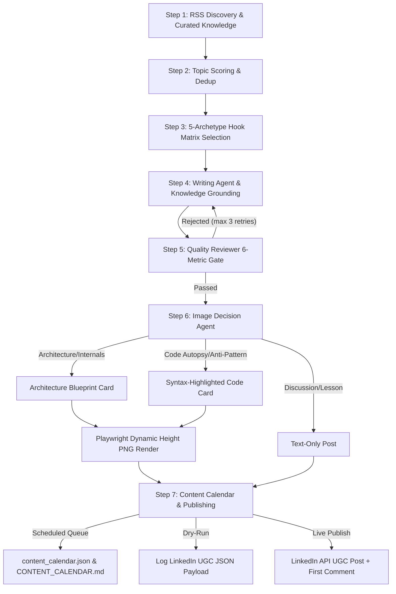

# Autonomous LinkedIn Engineering Agent

An autonomous publishing pipeline designed for **Senior Android Developer & Mobile Tech Lead** content. Researches and structures deep-dive technical posts, enforces zero AI jargon, renders high-resolution architecture blueprint and code cards via Playwright, and publishes to LinkedIn with author first-comment seeding.

**No VPS or heavy Docker containers needed. Operates serverless via GitHub Actions or locally.**

---

## Architecture Overview



---

## Tech Stack

| Tool | Purpose |
|---|---|
| **GitHub Actions** | Daily 09:00 AM IST scheduling (`cron: '30 3 * * *'`) |
| **Google Gemini** | Domain post generation, quality scoring, and structured card content |
| **Playwright + Jinja2** | High-DPI (3x scale, ~3240px wide) SVG/HTML/CSS card rendering |
| **SQLite3** | Persistent topic and content hash deduplication (`data/content_history.db`) |
| **LinkedIn REST API** | Direct OAuth publishing of text, image assets, and author first comment |

---

## 5 Blueprint Archetypes

Rotates deterministically through the calibrated formulas in `scripts/hook_matrix.py`:

1. **`HARDWARE_LOW_LEVEL_DEEP_DIVE`** — BLE ATT/GATT internals, MTU negotiation, battery drain, driver IPC.
2. **`CODE_AUTOPSY_TEARDOWN`** — Production memory leaks, coroutine cancellation exceptions, ANR autopsies.
3. **`SCALE_INCIDENT_WAR_STORY`** — 50M+ user streaming stalls, ExoPlayer buffer tuning, payment gateway race conditions.
4. **`OS_INTERNALS_DEEP_DIVE`** — Android 16/15 changes, 16KB page sizes, binder transaction buffer limits, runtime permissions.
5. **`CONTRARIAN_ARCHITECTURE_CALLOUT`** — Pragmatic critiques of Clean Architecture dogmatism, over-engineering, and premature abstraction.

---

## Quick Start (Local)

### 1. Set Up Environment

```bash
python3 -m venv .venv
source .venv/bin/activate
pip install -r requirements.txt
python -m playwright install chromium --with-deps
```

### 2. Configure `.env`

Copy `.env.example` to `.env` and fill in credentials:
- `GEMINI_API_KEY`: Google AI Studio key
- `LINKEDIN_ACCESS_TOKEN` & `LINKEDIN_PERSON_ID`: LinkedIn OAuth credentials (generate via `python scripts/get_linkedin_token.py`)

### 3. Local CLI Commands

```bash
# Preview post generation & quality review without publishing
python scripts/main.py --preview

# Dry-run execution (generates post, renders image, logs exact LinkedIn payload)
python scripts/main.py --dry-run

# Pre-generate and schedule a post into the calendar for tomorrow 09:00 AM IST
python scripts/scheduler.py --schedule-tomorrow

# View the active scheduled content queue
python scripts/scheduler.py --list

# Run tests
python -m unittest discover tests
```

---

## Content Calendar & Scheduling

LinkedIn's official REST API does not support native scheduling parameters; posts sent via the API are published immediately. 

This repository solves scheduling via an **Autonomous Content Calendar**:
1. **Staging**: Posts can be pre-generated, quality-gated, and queued in `data/content_calendar.json` and human-readable `CONTENT_CALENDAR.md`.
2. **Daily Execution Trigger**: When the daily runner executes (`09:00 AM IST`), `scripts/main.py` checks `calendar.get_due_post()`. If a post is queued for today, it publishes the pre-approved text, image card, and comment, and marks the item as published.
3. **Native Web UI Alternative**: You can copy-paste pre-generated content directly from `CONTENT_CALENDAR.md` into LinkedIn desktop's built-in scheduler (clock icon).

---

## Project Structure

```
├── .github/workflows/
│   └── linkedin-agent.yml         # GitHub Actions daily runner & calendar sync
├── config/
│   ├── persona.json               # Profile persona and tone calibration
│   └── sources.json               # Curated RSS engineering feeds
├── data/
│   ├── content_calendar.json      # Machine-readable scheduled posts queue
│   └── content_history.db         # Deduplication and publish history database
├── knowledge/                     # 10 domain reference guides for grounding
│   ├── android.md                 # Jetpack Compose, Coroutines, Memory, Binder IPC
│   ├── architecture.md            # Modularization, Clean Arch, MVI/Unidirectional
│   ├── ble_hardware.md            # GATT/ATT layers, MTU negotiation, BLE caching
│   ├── fintech.md                 # Idempotency, tokenization, payment SDKs
│   ├── kotlin.md                  # Kotlin 2.0 compiler, K2, Coroutines, Flow
│   ├── media_streaming.md         # ExoPlayer/Media3, LoadControl buffers, HLS/DASH
│   └── performance.md             # Baseline Profiles, Macrobenchmark, ANRs, App Startup
├── renderer/
│   ├── render.py                  # Playwright headless renderer (dynamic height, 3x scale)
│   └── templates/
│       ├── process_infographic_dark.html.j2    # Architecture Blueprint Card (Dark)
│       ├── process_infographic_light.html.j2   # Architecture Blueprint Card (Light)
│       ├── code_card_dark.html.j2              # Syntax Code Card (Dark)
│       └── code_card_light.html.j2             # Syntax Code Card (Light)
├── scripts/
│   ├── main.py                    # Main pipeline entrypoint & CLI
│   ├── scheduler.py               # Content calendar controller CLI
│   ├── infographic.py             # Card generator, token validator, image uploader
│   ├── hook_matrix.py             # 5 Blueprint hook archetypes
│   ├── services/
│   │   ├── calendar_manager.py    # Calendar queue CRUD and Markdown sync
│   │   ├── writing_agent.py       # Grounded technical post drafting
│   │   ├── quality_reviewer.py    # 6-metric strict quality gate
│   │   ├── image_decision.py      # Template and theme selection
│   │   ├── linkedin_publisher.py  # LinkedIn UGC API integration
│   │   ├── rss_fetcher.py         # Engineering blog discovery
│   │   └── topic_analyzer.py      # Topic evaluation and deduplication
│   └── storage/
│       └── history_manager.py     # SQLite history and fuzzy deduplication
├── CONTENT_CALENDAR.md            # Human-readable content calendar
└── requirements.txt               # Dependencies
```

---

## License

MIT
